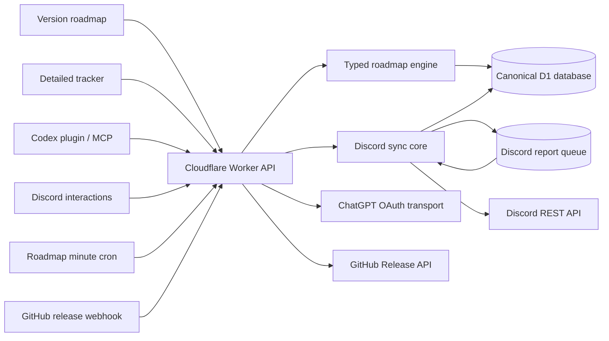

# SakuraCord Roadmap

A production-oriented, open-source roadmap platform for engineering teams that
want one canonical database, a focused public roadmap, a deliberately simple
Discord projection, forum synchronization, and conversational management
through MCP and Codex.

SakuraCord is the included configuration. New instances start with an empty
roadmap; the engine has no hard-coded SakuraCord project, lifecycle, or Discord
channel assumptions. A fork customizes one typed configuration layer and owns an
independent D1 database.

## What is included

- Separate, revision-safe schemas for the public version roadmap and detailed
  bug/feature tracker. Tracker records retain report-backed classification,
  acceptance criteria, source references, and stable IDs.
- Optimistic concurrency, idempotency keys, database-triggered audit history,
  and synchronization jobs. Roadmap mutations never create Git commits.
- A focused version-by-version React roadmap at `roadmap.sakuracord.app` and a
  complete status tracker at `tracker.sakuracord.app`, backed by one Worker and
  documented JSON API.
- Authenticated maintainer mutation endpoints with explicit lifecycle gates.
- A version-based Discord projection that edits one existing message and skips
  unchanged visible hashes.
- Feature Request and Bug Report forum ingestion, bot-mentioned follow-up evidence,
  attachments, reactions, moderated status tags, reconciliation, and
  active/archived thread support.
- Cloudflare Worker, D1, cron, and static assets.
- An independently deployable
  [SakuraCord DiscordBot](https://github.com/SakuraCordApp/DiscordBot) using
  free-tier Cloudflare queues for GitHub notifications.
- A protocol-native MCP server with 19 canonical roadmap and tracker tools plus optional
  read-only application-repository inspection.
- A valid Codex plugin and roadmap-management skill.
- A resumable, idempotent setup/doctor/deploy/upgrade CLI.
- Signed GitHub Release automation that collects the complete release commit
  range, writes AI-generated release notes, and posts one Discord announcement.
- ChatGPT/Codex-plan OAuth through an encrypted Worker-side session; no Codex
  CLI, self-hosted runner, or usage-billed OpenAI API key is required.

## Architecture



The D1 documents are authoritative. Version rows drive the public roadmap and
Discord message; item rows drive the detailed Tracker and forum tags. MCP can
manage both through the same revision-safe engine. Audit history and
synchronization work are recorded in the same database mutation.

## Quick start

Requirements: Node.js 20.19 or later, npm, and a Cloudflare account for remote
deployment. Discord is optional during local development.

```sh
npm install
npm run build --workspace @roadmap/cli
npm run roadmap -- setup --dry-run
npm run roadmap -- setup
```

The wizard prints all local and external changes before applying them. It
configures the project taxonomy, Cloudflare/D1, Discord, MCP, Codex, and optional
initial data. It never writes tokens to tracked files. Forum synchronization
runs in the Roadmap Worker. Deploy
[DiscordBot](https://github.com/SakuraCordApp/DiscordBot) separately when queued
GitHub-to-Discord notifications are wanted.

For local-only development:

```sh
npm install
npx wrangler d1 migrations apply sakuracord-roadmap --local
npm run build --workspace @roadmap/web
npm run dev
```

Copy `.env.example` to `.dev.vars` only for local secrets. `.dev.vars` is ignored.

## CLI

```text
roadmap setup
roadmap setup --dry-run
roadmap doctor
roadmap deploy
roadmap migrate
roadmap discord configure
roadmap discord verify
roadmap releases configure
roadmap releases connect-ai
roadmap releases status
roadmap mcp install
roadmap codex install
roadmap import
roadmap export
roadmap reconcile
roadmap upgrade
```

Every mutation command reports exact API or provider failures. `--json` produces
machine-readable output; setup supports explicit non-interactive flags for CI.

## Customize a fork

Safe instance-specific values live in `roadmap.instance.json`. Reusable
SakuraCord defaults and type validation live in `roadmap.config.ts` and
`packages/core/src/config.ts`. Arrays replace defaults; objects merge deeply.

The setup wizard can configure:

- project identity, public URL, branding, and application repository;
- areas, item types, lifecycle, priorities, and their colors;
- Cloudflare Worker and D1 names;
- Discord guild, forums, roadmap channel, unified tags, generated emoji, and
  maintainer roles;
- ChatGPT model, reasoning effort, encrypted OAuth, and automatic report
  analysis independently of optional release generation;
- local or remote MCP; and
- empty or file-imported initial data.

See [Configuration](docs/CONFIGURATION.md) for the full contract.

## Documentation

- [Architecture](docs/ARCHITECTURE.md)
- [Configuration](docs/CONFIGURATION.md)
- [Setup and deployment](docs/DEPLOYMENT.md)
- [Public and maintainer API](docs/API.md)
- [Discord integration](docs/DISCORD.md)
- [AI release automation](docs/RELEASES.md)
- [Gateway decision and fallback](docs/GATEWAY.md)
- [MCP and Codex](docs/MCP_CODEX.md)
- [Security](docs/SECURITY.md)
- [Operations, backup, and recovery](docs/OPERATIONS.md)
- [Upgrades](docs/UPGRADING.md)
- [Development and testing](docs/DEVELOPMENT.md)
- [Implementation report](docs/IMPLEMENTATION_REPORT.md)
- [Contributing](CONTRIBUTING.md)

## Verification

Run the complete local gate:

```sh
npm run check
```

It formats, lints, type-checks, runs unit/integration/security/migration tests,
and builds the Worker, web app, MCP server, and CLI. External
Discord and Cloudflare write verification is only run by explicit CLI commands
with valid credentials.

## License

MIT. SakuraCord is unofficial and is not affiliated with Discord.
