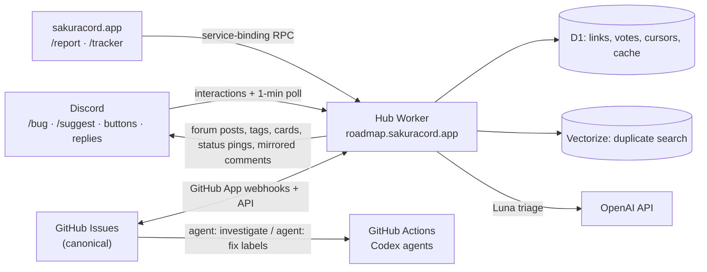

# SakuraCord Hub

The issue hub for [SakuraCord](https://github.com/SakuraCordApp/SakuraCord).
Bug reports and suggestions live as **GitHub Issues** in
`SakuraCordApp/SakuraCord`, and this Cloudflare Worker keeps them in sync with
the Discord forums and [sakuracord.app/tracker](https://sakuracord.app/tracker),
triages them with AI, and hands them to coding agents.

It also posts GitHub activity to the Discord updates channel (formerly the
separate DiscordBot Worker) and publishes the roadmap message.


```mermaid
flowchart LR
  D["Discord<br/>/bug · /suggest · buttons · replies"] -->|interactions + 1-min poll| H["Hub Worker<br/>roadmap.sakuracord.app"]
  W["sakuracord.app<br/>/report · /tracker"] -->|service-binding RPC| H
  G["GitHub Issues<br/>(canonical)"] <-->|GitHub App webhooks + API| H
  H -->|forum posts, tags, cards, status pings, mirrored comments| D
  H --> DB[("D1: links, votes, cursors, cache")]
  H --> V[("Vectorize: duplicate search")]
  H -->|Luna triage| O["OpenAI API"]
  G -->|agent: investigate / agent: fix labels| A["GitHub Actions<br/>Codex agents"]
```

## How it works

**GitHub is the source of truth.** Every report is an issue numbered `#N`.
Status lives in exactly one `status: …` label (or the close reason); areas and
priorities are labels; versions are milestones. The hub enforces one status,
area, and priority label per issue.

| Status               | GitHub representation                                                  | Discord tag          |
| -------------------- | ---------------------------------------------------------------------- | -------------------- |
| New                  | `status: new`                                                          | New                  |
| Needs info           | `status: needs info`                                                   | Needs Info           |
| Confirmed / Accepted | `status: confirmed`                                                    | Confirmed / Accepted |
| Planned              | `status: planned` + milestone (automatic when a milestone is set)      | Planned              |
| In progress          | `status: in progress` (automatic when a PR says `Fixes #N`)            | In Progress          |
| In nightly           | `status: in nightly` (automatic when the fix lands on `nightly`)       | In Nightly           |
| Shipped              | closed + `status: shipped` (automatic when a release contains the fix) | Shipped              |
| Done                 | closed as completed                                                    | Shipped              |
| Duplicate            | closed as duplicate                                                    | Duplicate            |
| Declined / Won't fix | closed as not planned + `status: declined`                             | Declined / Won't Fix |
| Can't reproduce      | closed as not planned + `status: can't reproduce`                      | Can't Reproduce      |

**Filing.** People use `/bug`, `/suggest`, the buttons in the pinned forum
posts and the roadmap message, the website form (Discord sign-in), or GitHub
issue forms. All four share `src/report/schema.ts`. Before anything is filed,
the hub searches for similar reports (bge-m3 embeddings in Vectorize) and
offers "That's mine", which follows the existing report instead. Only the bot
can create forum posts; everyone can reply in them.

**Three-way conversation sync.** Replies in a report's Discord post become
GitHub comments (polled every minute, including edits and deletions for 30
minutes). Every GitHub comment appears in the Discord post under the author's
name through a channel webhook. Website comments go to both. Each copy carries
an origin marker so nothing echoes.

**Notifications.** Reporters are pinged on every status change; voters ("Me
too") are also pinged when a report lands in nightly, ships, or closes.
Releases ping again when a fix reaches the regular (non-beta) channel.

**AI pipeline.**

1. _Triage_ (every new report, in the Worker, GPT-6 Luna): type, area,
   priority, clean title, one-line summary, duplicate judgement against the 8
   most similar reports, and questions when a bug can't be acted on.
2. _Investigation_ (GitHub Actions, read-only Codex): bugs that pass triage get
   `agent: investigate`; the agent finds the likely code and posts file/line
   findings, which are mirrored to Discord.
3. _Fix_ (maintainer-triggered): `agent: fix` (or Discord **Manage → Run fix
   agent**) runs Codex on the `xcode-27` runner and opens a **draft** PR against
   `nightly`. Nothing merges automatically.

**Maintainers in Discord** use **Manage** on a report card to confirm, ask for
info, plan for a milestone, mark duplicate/declined/can't reproduce, reopen, or
run the agents. Every action is applied on GitHub first; Discord follows.

## Layout

| Path               | Purpose                                                  |
| ------------------ | -------------------------------------------------------- |
| `src/config.ts`    | SakuraCord IDs, areas, priorities, statuses              |
| `src/report/`      | Shared report schema and the canonical issue-body format |
| `src/lifecycle.ts` | Status derivation and label enforcement                  |
| `src/sync/`        | Issue sync, triage, comments, PR/push/release tracking   |
| `src/discord/`     | Interactions, modals, cards, forum projection            |
| `src/github/`      | App auth, webhooks, activity feed                        |
| `src/api/`         | Public `/api/v2`, attachment proxy, admin endpoints      |
| `src/rpc.ts`       | Website RPC (report, me too, comment)                    |
| `scripts/`         | Issue-form generator, tag icons, legacy migration        |

## Operations

Production deploys through Cloudflare Workers Builds on pushes to `main`
(`npm run check`, then `npx wrangler deploy`). Never deploy from a local
session; see `AGENTS.md`.

Admin endpoints take `Authorization: Bearer $ROADMAP_ADMIN_TOKEN` (Keychain
`dev.sakuracord.roadmap-maintainer`):

| Endpoint                         | Use                                                                                                           |
| -------------------------------- | ------------------------------------------------------------------------------------------------------------- |
| `GET /admin/status`              | Configuration, job counts, recent failures                                                                    |
| `GET /admin/discord/permissions` | Missing bot permissions                                                                                       |
| `POST /admin/setup/github`       | Create/update labels                                                                                          |
| `POST /admin/setup/discord`      | Forum tags, posting lock, guide posts, webhooks, commands (body: `{"emojis": <npm run tag-icons -- --json>}`) |
| `POST /admin/reconcile`          | Resync from GitHub (`{"full": true}` for everything)                                                          |
| `POST /admin/reindex`            | Rebuild duplicate-search embeddings                                                                           |
| `POST /admin/retriage/:number`   | Run AI triage again                                                                                           |

Secrets: `DISCORD_APPLICATION_ID`, `DISCORD_PUBLIC_KEY`, `DISCORD_BOT_TOKEN`,
`GITHUB_APP_ID`, `GITHUB_APP_PRIVATE_KEY` (PKCS#8), `GITHUB_APP_WEBHOOK_SECRET`,
`OPENAI_API_KEY`, `ROADMAP_ADMIN_TOKEN`. The GitHub App's webhook URL is
`https://roadmap.sakuracord.app/webhooks/github-app`.

Editing the report form: change `src/report/schema.ts`, then regenerate the
GitHub issue forms in the app repository with
`npm run issue-forms -- ../SakuraCord/.github/ISSUE_TEMPLATE` and commit them
on `main`.

Everything runs on free tiers: Workers, D1, Queues, Vectorize, and Workers AI
on Cloudflare, plus GitHub Actions for the public repository. The only paid
part is OpenAI API usage (Luna for triage and investigation, Sol for fixes).

## Development

```sh
npm install
npm run check   # format, types, lint, tests, dry-run build
npm run dev     # local Worker (needs .dev.vars)
```

## License

MIT. SakuraCord is unofficial and is not affiliated with Discord.
