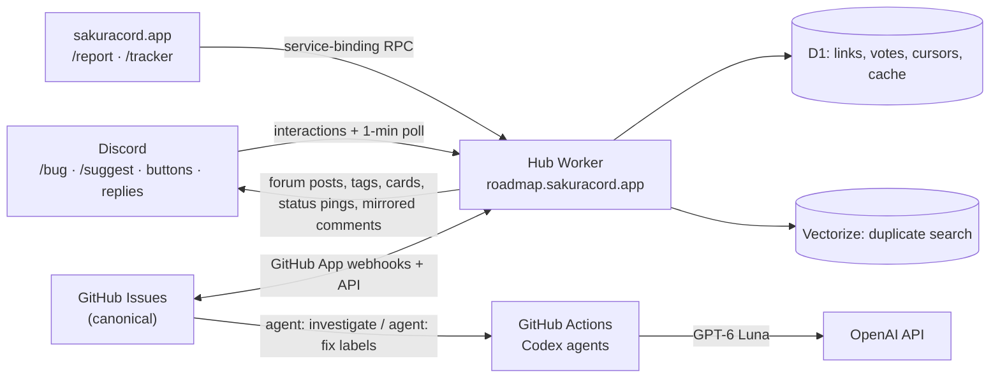

# SakuraCord Hub

The issue hub for [SakuraCord](https://github.com/SakuraCordApp/SakuraCord).
Bug reports and suggestions live as **GitHub Issues** in
`SakuraCordApp/SakuraCord`, and this Cloudflare Worker keeps them in sync with
the Discord forums and [sakuracord.app/tracker](https://sakuracord.app/tracker),
triages them with AI, and hands them to coding agents.

It also posts GitHub activity to the Discord updates channel (formerly the
separate DiscordBot Worker) and publishes the roadmap message.


```mermaid
flowchart LR
  D["Discord<br/>/bug · /suggest · buttons · replies"] -->|interactions + 1-min poll| H["Hub Worker<br/>roadmap.sakuracord.app"]
  W["sakuracord.app<br/>/report · /tracker"] -->|service-binding RPC| H
  G["GitHub Issues<br/>(canonical)"] <-->|GitHub App webhooks + API| H
  H -->|forum posts, tags, cards, status pings, mirrored comments| D
  H --> DB[("D1: links, votes, cursors, cache")]
  H --> V[("Vectorize: duplicate search")]
  G -->|agent: investigate / agent: fix labels| A["GitHub Actions<br/>Codex agents"]
  A -->|GPT-6 Luna| O["OpenAI API"]
```

## How it works

**GitHub is the source of truth.** Every report is an issue numbered `#N`.
Status lives in exactly one `status: …` label (or the close reason); areas and
priorities are labels; versions are milestones. The hub enforces one status,
area, and priority label per issue.

| Status               | GitHub representation                                                  | Discord tag          |
| -------------------- | ---------------------------------------------------------------------- | -------------------- |
| New                  | `status: new`                                                          | New                  |
| Needs info           | `status: needs info`                                                   | Needs Info           |
| Confirmed / Accepted | `status: confirmed`                                                    | Confirmed / Accepted |
| Planned              | `status: planned` + milestone (automatic when a milestone is set)      | Planned              |
| In progress          | `status: in progress` (automatic when a PR says `Fixes #N`)            | In Progress          |
| In nightly           | `status: in nightly` (automatic when the fix lands on `nightly`)       | In Nightly           |
| Shipped              | closed + `status: shipped` (automatic when a release contains the fix) | Shipped              |
| Done                 | closed as completed                                                    | Shipped              |
| Duplicate            | closed as duplicate                                                    | Duplicate            |
| Declined / Won't fix | closed as not planned + `status: declined`                             | Declined / Won't Fix |
| Can't reproduce      | closed as not planned + `status: can't reproduce`                      | Can't Reproduce      |

**Filing.** People use `/bug`, `/suggest`, the buttons in the pinned forum
posts and the roadmap message, the website form (Discord sign-in), or GitHub
issue forms. All four share `src/report/schema.ts`. Before anything is filed,
the hub searches for similar reports (bge-m3 embeddings in Vectorize) and
offers "That's mine", which follows the existing report instead. Only the bot
can create forum posts; everyone can reply in them.

**Three-way conversation sync.** Replies in a report's Discord post become
GitHub comments (polled every minute, including edits and deletions for 30
minutes). Every GitHub comment appears in the Discord post under the author's
name through a channel webhook. Website comments go to both. Each copy carries
an origin marker so nothing echoes.

**Notifications.** Report updates ping subscribers (reporters and "Me too"
followers) only when the report is completed: Shipped or Done. Other status
changes and later regular-release announcements are posted without pings.

**AI pipeline.**

1. _Triage and investigation_ (one GitHub Actions job, read-only Codex with
   GPT-6 Luna): every new bug or feature request gets `agent: investigate`.
   The agent reads nightly's source, the report, up to 30 recent comments,
   up to four downloaded screenshots, and up to twelve similar reports, including closed reports and both categories.
   Candidate search combines full-text and semantic matches; text search still
   works when semantic search is unavailable.
   It returns type, area, priority, title, summary, duplicate suggestions,
   missing-information questions, and code findings in one assessment comment.
   The hub validates the Actions-authored result, applies metadata on GitHub,
   and mirrors the comment. Duplicate suggestions never auto-close a report.
   Misclassified reports move to the correct Discord forum, retaining the old
   discussion with a link to the new post. No separate Luna call runs inside the Worker.
   The workflow verifies claimed fix commits against the reported release,
   latest published nightly, latest regular release, and current nightly code.
   High-confidence existing fixes enter release tracking; unreleased fixes stay
   open until a release contains them. A report whose build already contains the
   claimed fix remains open for regression investigation.
2. _Fix_ (maintainer-triggered): `agent: fix` or **Manage → Run fix agent**
   runs Codex with GPT-6 Luna on the `xcode-27` runner and opens a **draft** PR
   against `nightly`. Nothing merges automatically.

New bugs and suggestions must use the latest published nightly or latest
regular release. Website and Discord offer only those two choices; the hub
validates them again before filing. Native GitHub reports with old, missing,
or source-build versions are held for an update and retest. Accepted reports
keep their original release context as newer versions are published.

The assessment label stays until its result is applied. Failed runs can be
retried in Actions or through **Manage → Run triage & investigation**. Reporter
answers to information requests start a new combined assessment. If the report
body changes during a run, its stale result schedules a fresh assessment.
Each agent has one Components V2 status message per report thread, edited in
place across runs. GitHub workflow events start and finish updates; while a run
is active, the hub polls its job steps about once a minute. Unchanged cards are
not edited. Status polling uses leased jobs through internal Worker RPC, so it
continues when Queue delivery is paused. Triage adds its final assessment to the
same card, and successful fix runs link their draft PR. Failed, cancelled, and timed-out runs retain their
final status. Agent comments are updated in place when rerun; replayed result
deliveries are idempotent. GitHub publishing credentials stay outside the read-only agent step.

**Maintainers in Discord** use **Manage** on a report card to confirm, ask for
info, plan for a milestone, mark duplicate/declined/can't reproduce, reopen, or
run the agents. **Mark as fixed…** (or **Mark as implemented…**) accepts a
published release, or a commit/merged PR already on nightly. Unreleased fixes
stay open while release jobs check their ancestry. Published-release confirmation
closes the report as Shipped and records the maintainer's decision on GitHub;
a nightly confirmation is also tracked into later regular releases. The modal
offers the latest nightly/regular releases and accepts another published release
by tag or link. Manage requires the configured maintainer role, Administrator,
or Manage Server; every submitted action rechecks authorization.

GitHub remains canonical; Discord follows. For automatic fix linking, include
`Fixes #123` (also `Closes` or `Resolves`) in a PR title/body or a nightly commit
message. An open PR moves waiting work to In Progress; a merged fix moves it to
In Nightly; a release containing a recorded fix marks it Shipped.

Follow-up discussion syncs between platforms without starting an agent for every
message. A new reply from the identified original reporter while Needs Info
returns the report to triage and starts a fresh assessment. Other comments,
including replies on closed issues, do not reopen or start agents automatically.
Maintainers can rerun assessment or reopen through Manage.

## Layout

| Path               | Purpose                                                  |
| ------------------ | -------------------------------------------------------- |
| `src/config.ts`    | SakuraCord IDs, areas, priorities, statuses              |
| `src/report/`      | Shared report schema and the canonical issue-body format |
| `src/lifecycle.ts` | Status derivation and label enforcement                  |
| `src/sync/`        | Issue sync, triage, comments, PR/push/release tracking   |
| `src/discord/`     | Interactions, modals, cards, forum projection            |
| `src/github/`      | App auth, webhooks, activity feed                        |
| `src/api/`         | Public `/api/v2`, attachment proxy, admin endpoints      |
| `src/rpc.ts`       | Website RPC (report, me too, comment)                    |
| `scripts/`         | Issue-form generator, tag icons, legacy migration        |

## Operations

Production deploys through Cloudflare Workers Builds on pushes to `main`
(`npm run check`, then `npx wrangler deploy`). Never deploy from a local
session; see `AGENTS.md`.

Admin endpoints take `Authorization: Bearer $ROADMAP_ADMIN_TOKEN` (Keychain
`dev.sakuracord.roadmap-maintainer`):

| Endpoint                         | Use                                                                                                           |
| -------------------------------- | ------------------------------------------------------------------------------------------------------------- |
| `GET /admin/status`              | Configuration, job counts, recent failures                                                                    |
| `GET /admin/discord/permissions` | Missing bot permissions                                                                                       |
| `POST /admin/setup/github`       | Create/update labels                                                                                          |
| `POST /admin/setup/discord`      | Forum tags, posting lock, guide posts, webhooks, commands (body: `{"emojis": <npm run tag-icons -- --json>}`) |
| `POST /admin/reconcile`          | Resync from GitHub (`{"full": true}` for everything)                                                          |
| `POST /admin/jobs/run`           | Run one due D1 job for recovery; safe alongside the queue consumer                                            |
| `POST /admin/reindex`            | Rebuild duplicate-search embeddings                                                                           |
| `POST /admin/retriage/:number`   | Run AI triage again                                                                                           |

Secrets: `DISCORD_APPLICATION_ID`, `DISCORD_PUBLIC_KEY`, `DISCORD_BOT_TOKEN`,
`GITHUB_APP_ID`, `GITHUB_APP_PRIVATE_KEY` (PKCS#8), `GITHUB_APP_WEBHOOK_SECRET`,
`ROADMAP_ADMIN_TOKEN`. The app repository holds the `OPENAI_API_KEY` Actions
secret; the Worker does not need it. The GitHub App's webhook URL is
`https://roadmap.sakuracord.app/webhooks/github-app`. Agent progress requires
the GitHub App’s **Actions: read** permission and **Workflow run** webhook
subscription. The app repository’s agent workflows identify reports in their
`run-name`; unrelated label-triggered runs are ignored.

Editing the report form: change `src/report/schema.ts`, then regenerate the
GitHub issue forms in the app repository with
`npm run issue-forms -- ../SakuraCord/.github/ISSUE_TEMPLATE` and commit them
on `main`.

Everything runs on free tiers: Workers, D1, Queues, Vectorize, and Workers AI
on Cloudflare, plus GitHub Actions for the public repository. The only paid
part is OpenAI API usage: GPT-6 Luna for triage, investigation, and fixes.

## Free-tier capacity and recovery

The intended workload is fewer than five reports per day. Quotas are shared
with the account's other Workers; they are not dedicated to this hub.

- [Queues](https://developers.cloudflare.com/queues/platform/pricing/): 10,000
  operations/day, normally three per delivered message (write, read, delete).
  Batching does **not** reduce billable operations. Pending jobs share one
  notification for 15 minutes, so cron and repeated webhooks cannot flood the
  queue while its consumer is busy. A lost notification is retried after that
  lease; an execution is claimed atomically in D1.
- Quiet-day maintenance is at most roughly 650 queue operations: 144 issue
  reconciliations, 24 milestone refreshes and up to 48 roadmap jobs. Milestone
  webhooks still trigger immediate refreshes. Five reports, modest discussion
  and normal retries should fit around 1,000–2,000 operations/day; this is a
  workload estimate, not a measured guarantee. Each recently active Discord
  thread can add about 90 operations during its 30-minute edit/deletion watch.
- [D1](https://developers.cloudflare.com/d1/platform/pricing/): 5 million rows
  read and 100,000 written/day. At about 200 linked threads, the once-per-minute
  cursor scan reads roughly 288,000 rows/day, before other work and site traffic.
  Bulk inserts use at most 96 bound parameters, below D1's 100-parameter limit.
- [Vectorize](https://developers.cloudflare.com/vectorize/platform/pricing/):
  5 million stored dimensions and 30 million queried dimensions/month. The
  1,024-dimensional model allows about 4,882 stored reports. About 200 reports
  use 205,000 stored dimensions. Revisit retention or embedding dimensions as
  the issue archive approaches that ceiling.
- [Workers AI](https://developers.cloudflare.com/workers-ai/platform/pricing/):
  10,000 neurons/day. bge-m3 embeddings cost 1,075 neurons per million input
  tokens, so even 100,000 embedding tokens/day use about 108 neurons. Luna
  assessment and fix agents use the separately funded OpenAI API.
- Workers also have per-invocation CPU and subrequest limits, and an account
  request allowance. A low report count alone does not bound public website
  traffic, discussion volume, or usage by other projects.

If Queue sends fail, committed work remains pending in D1 and accepted
webhooks do not fail merely because their notification could not be sent.
Daily quota exhaustion suspends further notification attempts until 00:00 UTC.
Cron alternates between polling for new activity and running one pending job
without a Queue message (up to 720 recovery jobs/day). Report synchronization
takes priority over background work. Manage actions directly await their report's
sync through an internal Worker RPC before confirming success, even while Queues
are paused. If sync fails, the action reports partial completion and the durable
job retries it. Automatic synchronization is slower
while degraded, but does not depend on a Mac or a paid plan. The authenticated
`POST /admin/jobs/run` endpoint can drain one job per request after a burst.
`GET /admin/status` exposes `queuePausedUntil`, pending work and recent errors.

Queue messages expire after 24 hours on Free; the durable D1 job records do
not. A D1 or Workers quota exhaustion is a separate limit and can still pause
the system until reset. Inspect account-wide usage when activity grows.

## Development

```sh
npm install
npm run check   # format, types, lint, tests, dry-run build
npm run dev     # local Worker (needs .dev.vars)
```

## License

MIT. SakuraCord is unofficial and is not affiliated with Discord.
