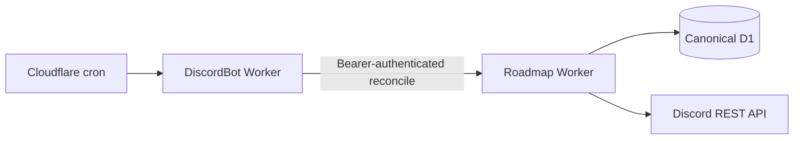

# Discord synchronization deployment

Discord forum posts are public threads. Roadmap must discover new posts,
replies, edits, deletions, reactions, tags, and archived threads while keeping
D1 canonical.

The transport lives in the independent
[`SakuraCordApp/DiscordBot`](https://github.com/SakuraCordApp/DiscordBot)
repository. Roadmap owns canonical data, interactions, reconciliation, and
Discord REST projection logic.

## Cloudflare provider

The production Cloudflare provider invokes Roadmap reconciliation every minute:



This provider has no persistent process and therefore stays within the Workers
free tier. It preserves synchronization correctness with up to 60 seconds of
latency. Reconciliation enumerates active and archived forum threads, messages,
replies, attachments, reactions, tags, and operational linkage.

Deploy DiscordBot with a Roadmap maintainer `ROADMAP_TOKEN` and the same
`ROADMAP_GATEWAY_INGEST_SECRET` used by Roadmap:

```sh
git clone https://github.com/SakuraCordApp/DiscordBot.git
cd DiscordBot
npm install
npx wrangler secret put ROADMAP_TOKEN
npx wrangler secret put ROADMAP_GATEWAY_INGEST_SECRET
npm run deploy
```

Roadmap controls immediate synchronization and status through
`https://discord-bot.sakuracord.app`. The shared ingest secret protects those
control endpoints.

## Real-time Node provider

DiscordBot also builds a portable `discord.js` Gateway provider with the
minimal `GUILDS`, `GUILD_MESSAGES`, `GUILD_MESSAGE_REACTIONS`, and privileged
`MESSAGE_CONTENT` intents. It sends normalized events through timestamped,
nonce-protected HMAC requests.

Run it under systemd, launchd, Docker, Fly.io, Railway, a VPS, or another
Node-compatible host with restart-on-failure. Do not run multiple unsharded
copies for the same bot token.

## Why the Cloudflare provider polls

An outbound Discord WebSocket keeps a Durable Object active and incurs
wall-clock duration. On the current free account, that design reached
Cloudflare's daily Durable Object duration limit and Cloudflare rejected further
operations. Scheduled REST reconciliation avoids silently depending on paid
capacity. A paid Durable Object or supervised Node provider can restore
real-time delivery if desired.

Primary references:

- <https://developers.cloudflare.com/durable-objects/platform/pricing/>
- <https://docs.discord.com/developers/events/gateway>
