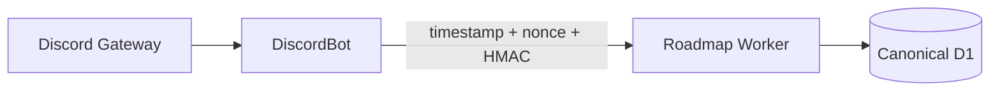

# Discord Gateway deployment

Discord forum posts are public threads. New posts, replies, message content,
attachments, and reaction events require a persistent Discord Gateway
connection with `GUILDS`, `GUILD_MESSAGES`, `GUILD_MESSAGE_REACTIONS`, and
privileged `MESSAGE_CONTENT`.

The transport now lives in the independent
[`SakuraCordApp/DiscordBot`](https://github.com/SakuraCordApp/DiscordBot)
repository. Roadmap owns the canonical D1 data, interactions, reconciliation,
and Discord REST projection logic. DiscordBot owns only the live Gateway
connection and sends normalized events to Roadmap's existing signed ingestion
endpoint.



There is no local workspace link between repositories. Either repository can be
cloned, installed, tested, and deployed by itself.

## Cloudflare Durable Object provider

The production provider in DiscordBot supports one small-instance Gateway
session:

- randomized heartbeat start and ACK timeout;
- identify/resume;
- persisted session ID, sequence, and resume URL;
- reconnect and invalid-session handling; and
- delivery of the minimal documented event set through replay-protected HTTPS.

Since 2026-06-19, an active outbound WebSocket keeps its Durable Object alive.
Cloudflare WebSocket Hibernation is server-side only and does not apply to this
outbound connection. Large installations must add Discord-recommended sharding
and session-start coordination.

Deploy DiscordBot with the same `DISCORD_BOT_TOKEN` and
`ROADMAP_GATEWAY_INGEST_SECRET` used by Roadmap. Roadmap controls start, stop,
and status through `https://discord-bot.sakuracord.app`; those endpoints require
the shared secret. DiscordBot's minute cron also repairs the session without
operator traffic.

```sh
git clone https://github.com/SakuraCordApp/DiscordBot.git
cd DiscordBot
npm install
npx wrangler secret put DISCORD_BOT_TOKEN
npx wrangler secret put ROADMAP_GATEWAY_INGEST_SECRET
npm run deploy
```

Then verify through Roadmap:

```sh
curl -X POST -H "Authorization: Bearer $ROADMAP_TOKEN" \
  -H "Idempotency-Key: gateway-start-$(date +%s)" \
  "$ROADMAP_API_URL/api/v1/discord/gateway/start"
```

## Node provider

DiscordBot also builds a portable `discord.js` fallback. Run it under systemd,
launchd, Docker, Fly.io, Railway, a VPS, or another Node-compatible host with
restart-on-failure. Do not run multiple unsharded copies for the same bot token.
The exact commands and environment contract are documented in the DiscordBot
README.

## Reconciliation

Gateway delivery is not the only correctness mechanism. `roadmap reconcile`
enumerates active and archived forum threads, messages, replies, attachments,
tags, and operational linkage. Run it after downtime, provider changes, intent
changes, or suspected drift. The Roadmap minute cron processes queued sync work
independently.

Primary references:

- <https://developers.cloudflare.com/changelog/post/2026-06-19-outbound-connections-keep-dos-alive/>
- <https://developers.cloudflare.com/durable-objects/examples/websocket-hibernation-server/>
- <https://docs.discord.com/developers/events/gateway>
